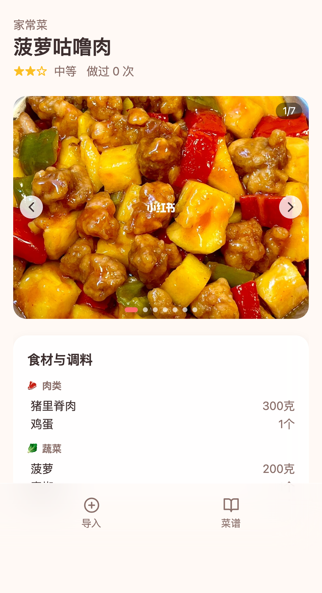

# 老公菜谱

本地自用的手机 H5 菜谱导入和做菜复盘工具。第一版支持粘贴小红书分享文本，后端尝试抓取内容，使用 DeepSeek 或 mock AI 解析成结构化菜谱，并保存到本地 SQLite。

## 界面预览

手机优先的 H5 界面，主要流程是粘贴小红书分享文本、查看已保存菜谱、进入详情复盘做菜结果。

<p>
  
  
  
</p>

- 导入页：粘贴小红书分享文本，一键抓取并解析成菜谱草稿。
- 菜谱页：按手机卡片浏览已保存菜谱，快速看到分类、标签和做过次数。
- 详情页：查看图片、食材、步骤和复盘记录，滑到底部可标记做过。

## 本地运行

```bash
npm install
cp .env.example .env
npm run dev
```

默认使用 mock AI：

```bash
AI_PROVIDER=mock
```

使用 DeepSeek 时配置：

```bash
AI_PROVIDER=deepseek
DEEPSEEK_API_KEY=你的 key
DEEPSEEK_MODEL=deepseek-v4-pro
```

## 测试

```bash
npm run test
npm run build
npm run test:e2e
```

## 第一版边界

- 本地单人自用。
- SQLite 本地数据库。
- 小红书抓取失败时允许手动补充正文。
- 不做登录、多用户、公网部署或复杂反爬。
